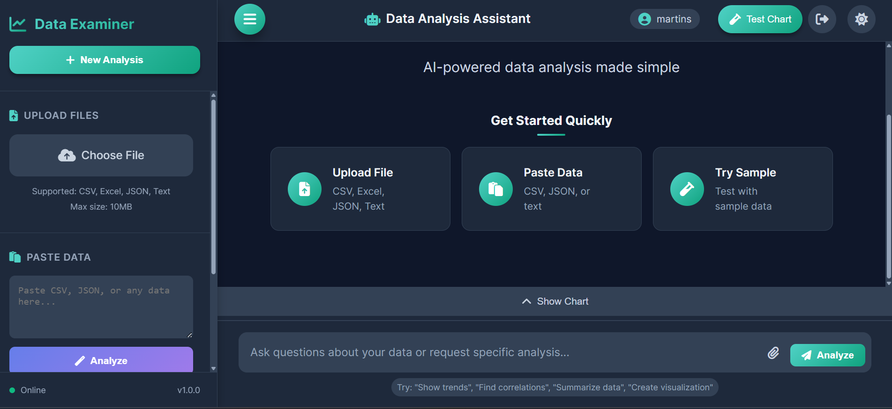
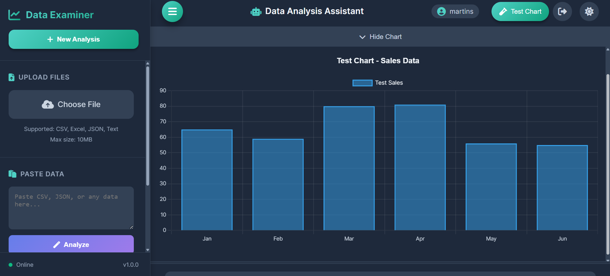
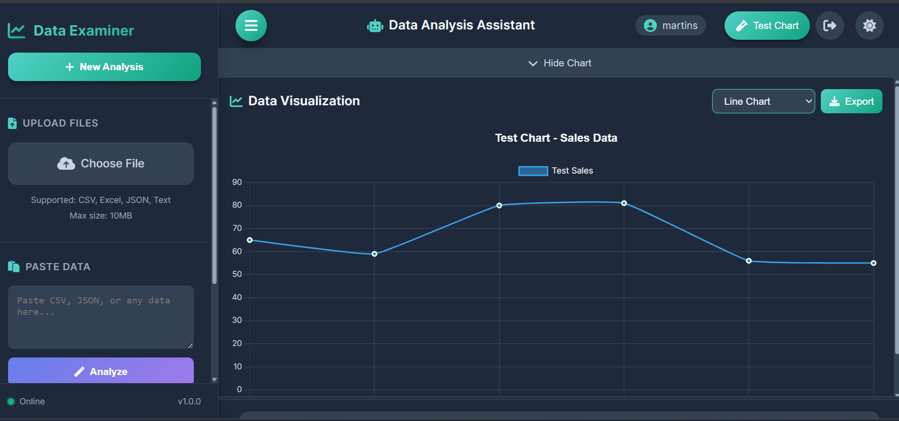
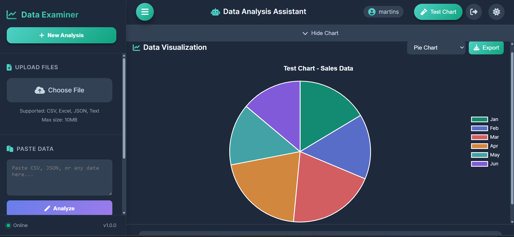
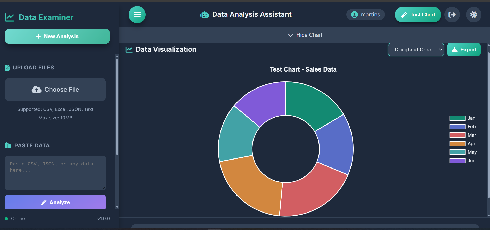

# 🎯 Data Examiner
Data Examiner is a sophisticated Progressive Web Application (PWA) that revolutionizes data analysis by combining the power of artificial intelligence with intuitive user interfaces. The platform enables users to upload, analyze, and visualize data from multiple file formats (CSV, Excel, JSON, TXT) through a conversational AI interface.

 Here is the link to the AI Data Examiner Application-heroku where you can login to access the Ai Powered Data Analysis App system [link](https://data-examiner-app-768e153aaa39.herokuapp.com/login)

   
   


**Data Examiner** is a cutting-edge, AI-powered Progressive Web Application (PWA) designed to revolutionize how users interact with and analyze data. Built with modern web technologies and powered by Groq's advanced AI models, it provides instant, insightful analysis of various data formats with beautiful visualizations.

### 🌟 Why Data Examiner?
- **Instant AI Analysis**: Upload any data file (CSV, Excel, JSON, TXT) and get immediate AI-powered insights
- **Intelligent Chat Interface**: Ask follow-up questions about your data in natural language
- **Beautiful Visualizations**: Automatically generated charts that adapt to your data
- **PWA First**: Install on any device and work offline
- **Privacy Focused**: No data storage - your data is analyzed in real-time and deleted
- **Modern Stack**: Built with Node.js, Express, and cutting-edge frontend technologies


 

## ✨ Key Features

### 🔬 **AI-Powered Analysis**

- **Groq AI Integration**: Leverages the powerful `llama-3.3-70b-versatile` model for deep data insights
- **Smart Formatting**: Responses are structured with Overview, Key Metrics, Insights, and Recommendations
- **Contextual Conversations**: Maintain conversation history for follow-up questions
- **Automatic Chart Generation**: AI detects when visualizations would be helpful and creates them

 

 ### 📂 **Multi-Format Support**

- CSV files with intelligent delimiter detection
- Excel spreadsheets (.xlsx, .xls)
- JSON data (arrays or objects)
- Text files with custom parsing
- Support for files up to 50MB

 

 ### 📊 **Advanced Visualization**

- Multiple chart types (Bar, Line, Pie, Doughnut)
- Automatic chart type selection based on data
- Export charts as PNG images
- Real-time chart type switching
- Responsive design that works on all devices
- Dark/Light theme support for charts

 

### 🎨 **Beautiful UI/UX**

- **Progressive Web App**: Install on any device
- **Dark/Light Theme**: Toggle between modes with smooth transitions
- **Responsive Design**: Works flawlessly on desktop, tablet, and mobile
- **Animated Interactions**: Smooth animations and transitions
- **Toast Notifications**: User-friendly feedback system
- **Loading States**: Beautiful loading animations with AI processing indicators

 


 ## 📁 Project Structure

 ```
data-examiner-app/
├── assets/                    # Frontend assets
│   ├── src/                   # JavaScript source files
│   │   ├── app.js             # Main application logic
│   │   ├── api.js             # API client
│   │   ├── chart.js           # Chart management
│   │   └── file-analyzer.js   # File parsing utilities
│   ├── index.html             # Main application page
│   ├── login.html             # Authentication page
│   ├── styles.css             # Global styles
│   ├── manifest.json          # PWA manifest
│   ├── service-worker.js      # Service worker
│   ├── favicon.ico            # Favicon
│   ├── favicon/               # Favicon variants
│   └── icons/                 # PWA icons
├── server.js                   # Express server
├── package.json                # Dependencies
├── .env                        # Environment variables
├── uploads/                    # Temporary upload directory
└── .gitignore                  # Git ignore rules

 ```

## **Core Value Proposition**

In today's data-driven world, extracting meaningful insights from raw data often requires specialized skills and complex tools. Data Examiner democratizes data analysis by providing:
 
 - **AI-Powered Insights:**  Leveraging Groq's advanced Llama 3.3 70B model, the application transforms raw data into structured, actionable insights complete with key metrics, trends, and recommendations.
 
 - **Conversational Interface:** Users can interact with their data naturally, asking follow-up questions and diving deeper into specific aspects without needing to know complex query languages.

 - **Automated Visualization:** The AI intelligently determines when visualizations would enhance understanding and automatically generates appropriate charts, eliminating the need for manual chart creation.

 - **Accessibility First:** As a PWA, Data Examiner works on any device, can be installed locally, and functions offline - making sophisticated data analysis accessible anywhere, anytime.

 - **Privacy-Centric Design:** All data analysis happens in real-time with no persistent storage. Files are automatically deleted after processing, ensuring user data remains private and secure.

## **Technical Excellence**

Built on a modern Node.js/Express backend with a vanilla JavaScript frontend, Data Examiner demonstrates how cutting-edge AI can be integrated into practical, user-friendly applications without sacrificing performance or user experience. The application features:

  - **Advanced File Processing:** Robust parsing engines handle various data formats with intelligent type detection

  - **Real-time AI Integration:** Direct integration with Groq's ultra-fast inference API

  - **State Management:** Sophisticated conversation tracking for contextual follow-up questions

  - **Responsive Design:** Beautiful, adaptive UI that works on everything from smartphones to 4K monitors

  - **PWA Capabilities:** Offline support, installability, and native app-like experience
  
Data Examiner represents the future of data analysis - where powerful AI meets intuitive design to make data insights accessible to everyone, regardless of their technical expertise.  


 ### 🔐 **Security & Privacy**

- User authentication system (local storage based)
- File uploads are automatically deleted after analysis
- Helmet.js for secure HTTP headers
- CORS protection
- Rate limiting ready
- No persistent data storage

### 📱 **PWA Features**

- Offline capability with service workers
- Installable on any device
- Add to home screen
- Push notifications ready
- Background sync capability


## 🛠️ **Technology Stack**

### Backend
- **Node.js** - Runtime environment
- **Express** - Web framework
- **Multer** - File upload handling
- **XLSX** - Excel file parsing
- **CSV-Parser** - CSV file processing
- **Helmet** - Security headers
- **Compression** - Performance optimization
- **UUID** - Unique ID generation

### Frontend

- **Vanilla JavaScript** - No framework dependencies
- **Chart.js** - Beautiful, responsive charts
- **Font Awesome** - Icon library
- **Service Workers** - PWA functionality
- **Local Storage** - Client-side data persistence

### AI Integration

- **Groq API** - Ultra-fast AI inference
- **Llama 3.3 70B** - State-of-the-art language model

## 📦 Installation
- Node.js 18.x or higher
- npm 9.x or higher
- A Groq API key (get one at [console.groq.com](https://console.groq.com))

### Quick Start

1. **Clone the repository**
   ```bash
   git clone https://github.com/Ebuka-martins/data-examiner-app.git
   cd data-examiner-app


## **Install dependencies**
``npm install``

## **Start the development server**
``npm run dev``

## **Open your browser**
``http://localhost:3000``

## **Production Deployment**

 ```
 # Build and start production server
npm start
  ```

## **Package.json Scripts**

```
{
  "scripts": {
    "start": "node server.js",
    "dev": "nodemon --ignore 'uploads/' server.js",
    "clean": "rm -rf node_modules uploads",
    "reset": "npm run clean && npm install",
    "setup": "npm install && mkdir -p uploads assets/icons assets/favicon assets/src",
    "heroku-postbuild": "echo 'Build completed successfully'"
  }
}

```

## **📖 Usage Guide**

### **1. First Time Setup**
- Navigate to /login to create an account
- Use any email and password (stored locally in your browser)
- After login, you'll be redirected to the main app

### **2. Upload Data**
- Click the colorful menu button (top-left) to open the sidebar
- Choose one of three methods:
  - **Upload File**: Select CSV, Excel, JSON, or text files
  - **Paste Data**: Copy-paste your data directly
  - **Try Sample**: Load sample sales data for testing

### **3. Analyze Your Data**
- Ask questions in natural language:
  - "Show me sales trends over time"
  - "What's the average profit by region?"
  - "Find correlations between variables"
  - "Create a visualization of expenses" Or simply click "Analyze" for automatic insights

### **4. Interact with Results**
- View AI-generated insights in a beautiful, structured format
- Toggle between different chart types
- Export charts as PNG images
- Ask follow-up questions to dig deeper

### **5. Manage Your History**
- All analyses are saved in the sidebar
- Click any history item to reload previous analysis
- Delete individual items or clear all history
- Sessions maintain conversation context

### **6. PWA Features**
- Install the app on your device (look for the install button)
- Use offline (limited functionality)
- Add to home screen for quick access


## **🧪 API Documentation**

### **EndPoint**

  ```
  POST /api/analyze/file
Upload and analyze a file

Body: multipart/form-data with file and optional question

Response: Analysis with optional chart data

POST /api/analyze/text
Analyze pasted text data

Body: { text, question, conversationId }

Response: AI analysis with chart data

POST /api/chat/followup
Ask follow-up questions in a conversation

Body: { question, conversationId }

Response: Contextual AI response

GET /api/conversation/:sessionId
Retrieve conversation history

Response: Array of conversation messages

DELETE /api/conversation/:sessionId
Clear conversation history

GET /api/test/chart
Test endpoint with sample chart data

GET /api/health
Health check endpoint


  ```

## **🔧 Advanced Configuration**

### **Customizing AI Behavior**

Edit the system prompt in server.js to change how the AI analyzes data:

```
// Modify the system message in analyzeDataWithAI function
{
  role: 'system',
  content: 'Your custom prompt here...'
}

```

### **Chart Customization**

Modify chart.js to customize colors, animations, and behavior:

```
// Change color palette
this.colorPalettes = {
  primary: ['#your-colors-here'],
  // ...
}

```

### **Styling Themes**

Edit CSS variables in styles.css to customize the look:

```
:root {
  --primary-color: #your-color;
  --primary-gradient: linear-gradient(135deg, #color1 0%, #color2 100%);
  /* ... */
}

```

### **🤝 Contributing**
  
  ### **Development Process**
   
   - Fork the repository
   - Create a feature branch (git checkout -b feature/amazing-feature)
   - Commit your changes (git commit -m 'Add amazing feature')
   - Push to the branch (git push origin feature/amazing-feature)
   - Open a Pull Request

  ### **Code Style**

    - Use 2 spaces for indentation
    - Follow existing code patterns
    - Add comments for complex logic
    - Update documentation for new features

  
  ### **🧪 Testing**

  ```
  # Run tests (when implemented)
npm test

# Manual testing
npm run dev
# Visit http://localhost:3000/test-chart for chart testing

  ```


## **📊 Performance**

 - Lighthouse Score: 90+ (PWA, Performance, Accessibility)
 - First Contentful Paint: < 1.5s
 - Time to Interactive: < 3s
 - Bundle Size: Optimized with compression

## **🔒 Security**

- All file uploads are scanned and deleted after analysis
- Helmet.js provides secure HTTP headers
- Input validation on all endpoints
- Rate limiting ready (can be enabled)
- No sensitive data stored


## **🚢 Deployment**

   ### **Heroku**

   ```
    heroku create your-app-name
    heroku config:set GROQ_API_KEY=your_key_here
    git push heroku main

   ```

   ### **Render**

   - Connect your GitHub repository
   - Set environment variables in dashboard
   - Deploy from main branch


## **🙏 Acknowledgments**
  
  - **Groq** for providing the incredible AI API

  - **Chart.js** for the beautiful visualization library

  - **Font Awesome** for the amazing icons

  - All our contributors and users


## **🗺️ Roadmap**

  - Database integration for persistent storage
  - Team collaboration features
  - More chart types (scatter, radar, polar area)
  - Data export to PDF/Excel
  - API key management for users
  - WebSocket for real-time collaboration
  - Docker containerization
  - Unit and integration tests
  - Mobile apps (React Native)


